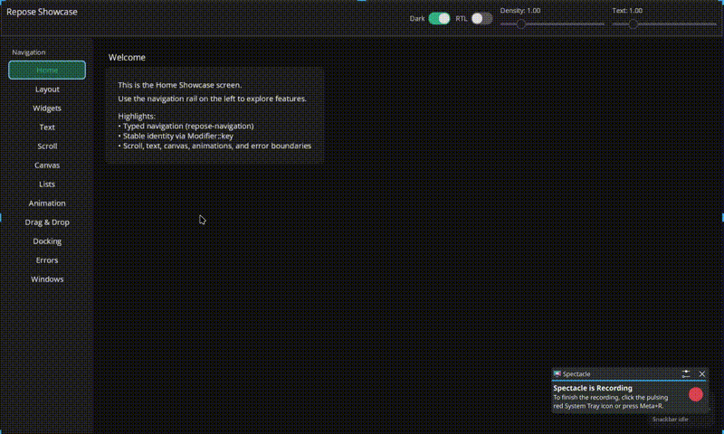

# Repose

A small, composable UI toolkit in Rust with a Compose-like API, cross-platform runners (desktop/Android/web), and a WGPU renderer.

[](https://crates.io/crates/repose-core)
[](LICENSE)
[](https://mlm-games.github.io/repose/)

> **Status: pre-1.0**. API (mostly minor) might change. A few working apps exist, and there shouldn't be any major issues.

Useful for simple apps (though aiming for bigger ones in the future), and for developers who want a Compose-like experience in Rust without the overhead of embedding a web view or maintaining separate native UI codebases.

<!-- Rebuilds the entire view tree each frame (since Views are lightweight data). State lives in reactive signals. Layout uses Taffy (Flexbox/Grid). Rendering uses WGPU. Platform integration (windowing, input, clipboard) is handled by platform-specific runners. -->

## Features

- **Declarative composition** — `View` functions, reactive `Signal`s, `remember` / `remember_mutable`, derived state (`produce_state`), effects, and composition locals
- **Cross-platform runners** — Desktop (winit), Android (native activity), WebAssembly (canvas + WGPU/WebGL)
- **Layout** — Flexbox and Grid via [Taffy](https://github.com/DioxusLabs/taffy); modifiers for padding, gaps, alignment, clipping, borders, etc.
- **GPU rendering** — Rectangles, rounded clips, borders, ellipses, text, and images through a WGPU backend (atlases + pipelines)
- **Text** — Shaping, metrics, wrapping/ellipsis with caching (`repose-text` / Parley + font stack)
- **Input** — Pointer events, scrolling, focus traversal, IME, gestures
- **Widgets & building blocks** — Text, buttons, text fields, checkbox, switch, slider, `ScrollArea`, `LazyColumn` / lazy lists, pager, overlays & snackbars, color picker, selection, subcompose
- **Material-inspired components** — Material 3-style controls, ripples, symbols/icons (`repose-material`)
- **Navigation** — Typed back-stack navigation with transitions (`repose-navigation`)
- **Canvas** — Custom painting surface (`repose-canvas`)
- **Docking** — Dockable panels (`repose-docking`)
- **Accessibility** — AccessKit on desktop + semantic node pipeline
- **DevTools** — Inspector overlay (Ctrl+Shift+I)
- **Animation** — Runtime animation clock and helpers

### Non-Goals

- Full feature parity with mature toolkits (prioritising having a minimal and maintainable toolkit, that should work for 80% of the tasks, until i get enough funding, or after years of usage)

## Quick Start

### Prerequisites

- For desktop: system dependencies for WGPU (varies by OS)
- For web: `trunk` (`cargo install trunk`)
- For Android: Android SDK/NDK and `cargo-apk`

### Run the Showcase

**Desktop:**
```bash
cargo run -p showcase --features desktop-bin
```

**Web:**
```bash
cd examples/showcase
trunk serve
```

Or try the [hosted demo](https://mlm-games.github.io/repose/).

**Android:**
```bash
cd examples/showcase
cargo rapk run --target aarch64-linux-android --lib
```

## Usage

```rust
use repose_core::prelude::*;
use repose_ui::*;

fn Counter() -> View {
    let count = remember_mutable(|| 0);

    Column(Modifier::new().padding(16.0)).child((
        Text(format!("Count: {}", *count.get())),
        Button("Increment", {
            let count = count.clone();
            move || count.update(|c| *c += 1)
        }),
    ))
}

fn main() -> anyhow::Result<()> {
    repose_platform::run_desktop_app(|_sched, _ctx| Counter())
}
```

**State management:**
```rust
// Signal for shared/global state
let theme = signal(Theme::default());
theme.set(Theme::dark());

// Mutable for component-local state that should always recompose
// (auto-requests a frame on set/update)
let input = remember_mutable(|| String::new());

// Derived state
let full_name = produce_state("full", {
    let first = first_name.clone();
    let last = last_name.clone();
    move || format!("{} {}", first.get(), last.get())
});
```

**Layout:**
```rust
Row(Modifier::new().gap(8.0)).child((
    Text("Left"),
    Spacer(),
    Text("Right"),
))
```

**Navigation:**
```rust
let stack = remember_back_stack(Route::Home);
let navigator = Navigator { stack: (*stack).clone() };

// Push route
navigator.push(Route::Details);

// Pop (back button)
back::set(Some(Rc::new(move || navigator.pop())));
```

## GIF




## Inspiration

Wanted an UI which was short and easy to understand by looking at the code (essentially declaritive, helps balance out rust ig :), while being similar to Compose, (since i personally like the design of Jetpack Compose. Similar to Iced, which was also based on elm-ui)


## Architecture

| Crate | Role |
|-------|------|
| `repose-core` | Signals, effects, runtime, view model, locals, animation |
| `repose-ui` | Widgets, layout (Taffy), paint, hit regions, semantics |
| `repose-render-wgpu` | WGPU renderer, atlases, pipelines |
| `repose-platform` | Platform runners (winit desktop / Android / WASM) |
| `repose-text` | Text shaping, metrics, caches |
| `repose-material` | Material-inspired components & symbols |
| `repose-navigation` | Typed stack navigation + transitions |
| `repose-canvas` | Custom drawing surface |
| `repose-devtools` | Inspector HUD |
| `repose-docking` | Dockable panels |

## Projects Using Repose

These were built to test the toolkit in real apps:

- **[startpose](https://github.com/mlm-games/startpose)** - Web startpage
- **[wifi-exporter](https://github.com/mlm-games/wifi-exporter)** - Android WiFi importer/exporter
- **[soredowe](https://github.com/mlm-games/soredowe)** - Linux pacman/flathub/aur/appimage UI for install/updates
- **[renamite](https://github.com/mlm-games/renamite)** - Motion / vector animation editor (repose based editor all 3 platforms)
- **[my-ecosystem-template-bevy](https://github.com/mlm-games/my-ecosystem-template-bevy)** - 2D Bevy game template (uses repose-bevy for UI and inputs)
- **[ednitar-clap](https://github.com/mlm-games/ednitar-clap)** - Rust CLAP guitar effect plugin (only for the demonstration of repose-audui (baseview wrapper))

## Contributing

Issues and PRs are welcome, especially for:
- Correctness bugs
- Performance regressions (include a repro)
- Platform gaps (except external issues like Android IME, if documented)

### Development Setup

```bash
git clone https://github.com/mlm-games/repose
cd repose
cargo test --workspace
```

## Support

Consider donating if you'd like to support it's development. Open an issue or a discussions for bugs or questions.

## Mentions

- [Taffy](https://github.com/DioxusLabs/taffy) for layout
- [wgpu](https://github.com/gfx-rs/wgpu) for cross-platform graphics
- [AccessKit](https://github.com/AccessKit/accesskit) for accessibility
- Heavily inspired by Jetpack Compose's API design

## License

MPL-2.0 - see [LICENSE](LICENSE).

See [LICENSE](LICENSE) for more info.
